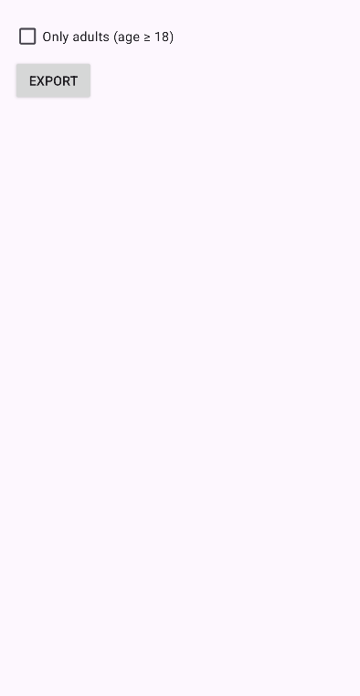
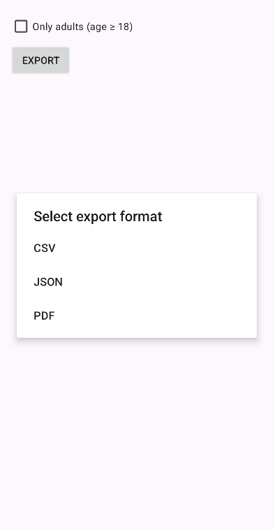
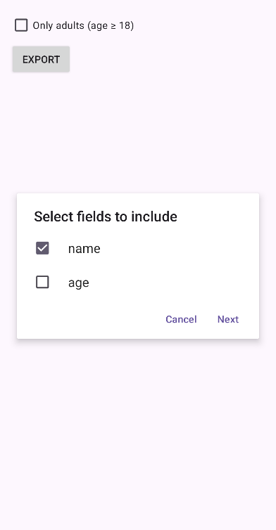
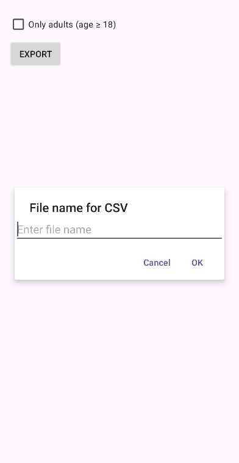
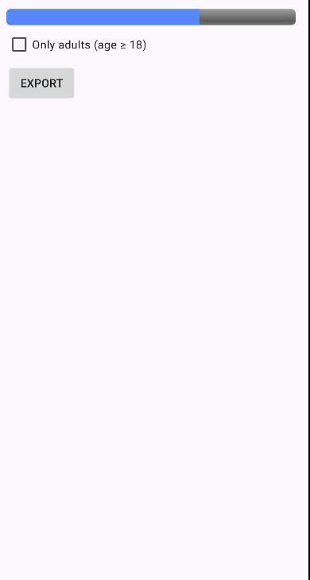

# EasyExporter Library

EasyExporter is a lightweight Android library written in Java that provides one‑click export of your data to **CSV**, **JSON**, or **PDF** formats. It’s designed for quick integration into any Android app, offering advanced features like field selection, data filtering, progress indication, localization, dark mode & RTL support, and customizable PDF layout.

For FULL DEMO, See the App in this repo.

---
## Screenshots










---
## Features

- **CSV, JSON & PDF Export**  
  Export any `List<T>` to CSV, JSON or PDF with a single method call.

- **Async & UI‑thread Callbacks**  
  All exports run off the main thread. Results (`onSuccess`/`onError`) come back on the UI thread.

- **Custom Output Directory**  
  Choose where exports are saved, via overload constructor:
  ```java
  new EasyExporter(context, customOutputDir);
  ```

- **Entity Field Selection**  
  Let users pick which fields to include in CSV/PDF via a built‑in `ExportButton`.

- **Data Filtering**  
  Accepts a `Predicate<T>` to include only items matching your criteria.

- **Progress Indication**  
  Reports per‑item progress with a determinate `ProgressListener`.

- **Multi‑Language Support**  
  All UI strings (dialogs, toasts) are in `strings.xml` and fully translatable.

- **Dark Mode Ready**  
  Follows your Material DayNight theme and supports tinting.

- **RTL Layout Support**  
  Dialogs and UI flip automatically for RTL locales like Arabic or Hebrew.

- **Custom PDF Configuration**  
  Customize page size, margins, text size, column & row spacing via `PdfConfig`.

---

## Installation

1. **Include the library module**  
   In your root `settings.gradle.kts`:
   ```kotlin
    dependencyResolutionManagement {
		repositoriesMode.set(RepositoriesMode.FAIL_ON_PROJECT_REPOS)
		repositories {
			mavenCentral()
			maven { url = uri("https://jitpack.io") }
		}
	}
   ```

2. **Add dependency**  
   In your `app/build.gradle.kts`:
   ```kotlin
   dependencies { 
     implementation("com.github.islamsaadi:EasyExporter:1.0.1")
     // other deps…
   }
   ```

3. **Enable RTL & Night**  
   In `AndroidManifest.xml`:
   ```xml
   <application
     android:supportsRtl="true"
     android:theme="@style/Theme.MyApp">
     ...
   </application>
   ```

---

## Quick Start

### 1. Initialize

```java
EasyExporter exporter = new EasyExporter(this);
// or with custom folder
File docs = Environment.getExternalStoragePublicDirectory(Environment.DIRECTORY_DOCUMENTS);
EasyExporter exporter = new EasyExporter(this, docs);
```

### 2. Prepare Data & Fields

```java
List<SampleItem> data = Arrays.asList(
  new SampleItem("Alice", 30),
  new SampleItem("Bob",   25)
);
List<String> fields = Arrays.asList("name", "age");
```

### 3. Export CSV / JSON / PDF

```java
exporter.exportAsCsv(data, fields, "users", callback);
exporter.exportAsJson(data, "users", callback);
exporter.exportAsPdf(data, fields, "users", callback);
```

### 4. Filtering & Progress

```java
Predicate<SampleItem> adultsOnly = item -> item.age >= 18;
ProgressListener progress = (done, total) -> { /* update UI */ };
exporter.exportAsCsv(data, fields, "adults", adultsOnly, progress, callback);
```

### 5. PDF Custom Config

```java
PdfConfig config = new PdfConfig.Builder()
  .setPageWidth(800)
  .setPageHeight(1200)
  .setMarginLeft(20)
  .setRowSpacing(30)
  .build();

exporter.exportAsPdf(
  data, fields, "custom",
  adultsOnly, progress, config, callback
);
```

### 6. Field Selection UI

```xml
<com.islamsaadi.easyexporterlib.ui.ExportButton
  android:id="@+id/btn_export"
  android:layout_width="wrap_content"
  android:layout_height="wrap_content"
  android:text="@string/export_button_label"/>
```

```java
ExportButton btn = findViewById(R.id.btn_export);
btn.setAvailableFields(fields);
btn.setOnExportClickListener((format, fileName, selectedFields) -> {
  // call export based on format
});
```

---

## API Reference

### `class EasyExporter`

- `EasyExporter(Context context)`
- `EasyExporter(Context context, File outputDir)`
- `<T> void exportAsCsv(List<T> data, List<String> fields, String fileName, Callback cb)`
- `<T> void exportAsCsv(List<T> data, List<String> fields, String fileName, Predicate<T> filter, ProgressListener pl, Callback cb)`
- `<T> void exportAsJson(...)` similar overloads
- `<T> void exportAsPdf(...)` similar overloads with `PdfConfig`

### `interface EasyExporter.Callback`

```java
void onSuccess(String filePath);
void onError(Exception e);
```

### `interface EasyExporter.ProgressListener`

```java
void onProgress(int done, int total);
```

### `class PdfConfig`

Builder for PDF page size, margins, spacing, text size.

### `class ExportButton`

A `AppCompatButton` subclass that shows format, field‑pick & filename dialogs.  
Methods:
- `setAvailableFields(List<String>)`
- `setOnExportClickListener(OnExportClickListener)`

---

## License

MIT © Islam Saadi
